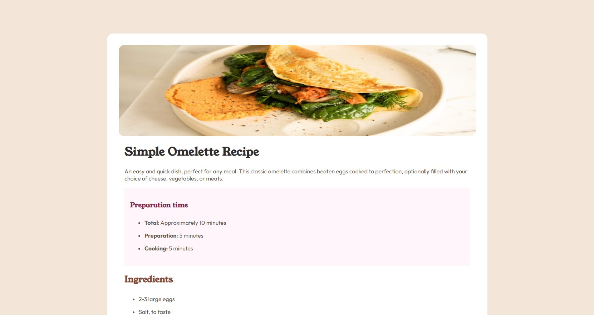
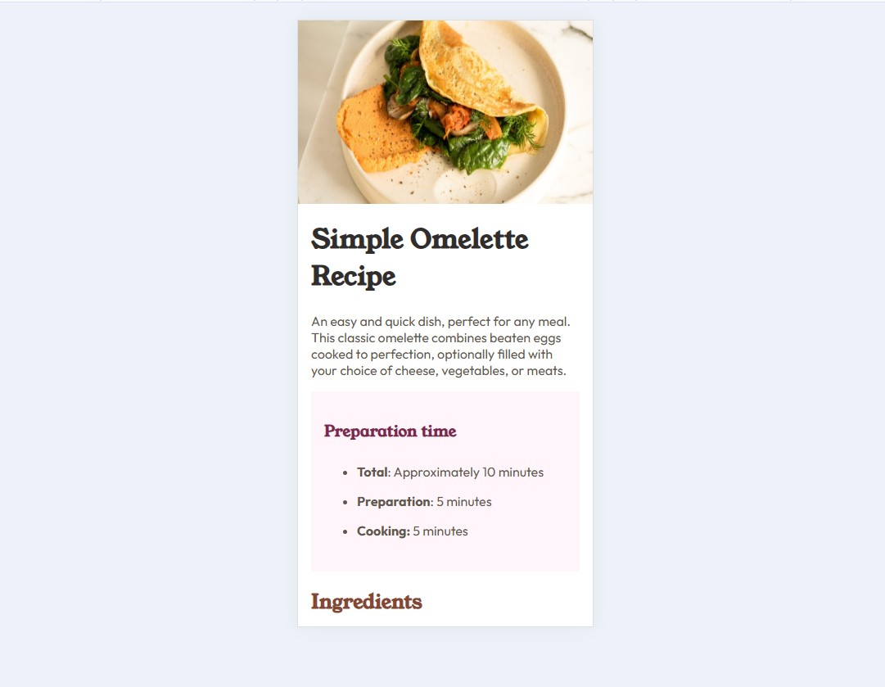

# Frontend Mentor - Recipe page solution

This is a solution to the [Recipe page challenge on Frontend Mentor](https://www.frontendmentor.io/challenges/recipe-page-KiTsR8QQKm). Frontend Mentor challenges help you improve your coding skills by building realistic projects. 

## Table of contents

- [Overview](#overview)
  - [The challenge](#the-challenge)
  - [Screenshot](#screenshot)
  - [Links](#links)
- [My process](#my-process)
  - [Built with](#built-with)
  - [What I learned](#what-i-learned)
- [Author](#author)

## Overview

### Screenshot

### Links

- Solution URL: [solution URL](https://www.frontendmentor.io/solutions/recipe-page-Cg8rXNUvh1)
- Live Site URL: [live site URL](https://recipe-page-fawn-one.vercel.app/)

## My process

### Built with

- Semantic HTML5 markup
- CSS custom properties
- Flexbox
- Mobile-first workflow

### What I learned

Use media query

## Author

- Website - [Shereef Hamed](https://shereefhamed.github.io/portfolio/)
- Frontend Mentor - [@shereefhamed](https://www.frontendmentor.io/profile/shereefhamed)

